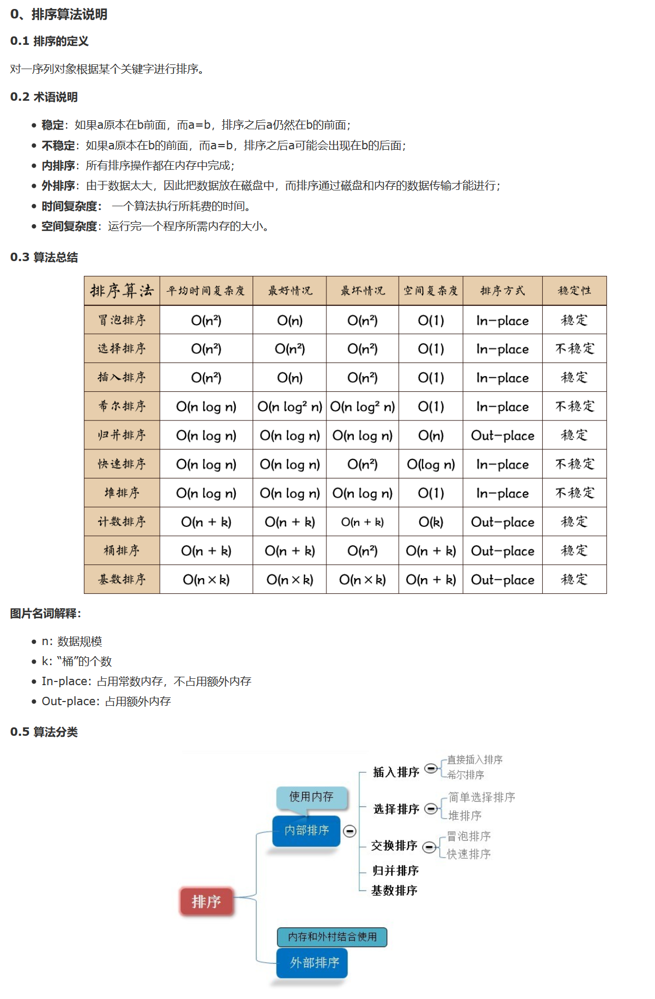

数据结构与算法：[简介](https://www.cnblogs.com/ysocean/p/7889153.html)

- 线性结构
  - 数组
  - 栈
  - 队列
  - 链表
    - 单链表
    - 双链表
- 树形结构
  - 二叉树
  - 红黑树
  - 哈夫曼树
  - 2-3-4树？
  - AVL树？
  - 伸展树？

- 堆
- 图
- 排序算法
  - 冒泡排序
  - 选择排序
  - 插入排序
- 查找算法
- 其他算法


## 线性结构

### 数组

[Java数据结构和算法（二）——数组](https://www.cnblogs.com/ysocean/p/7894448.html)


### 栈

#### 通过数组实现栈

>  参考文章：[Java数据结构和算法（四）——栈](https://www.cnblogs.com/ysocean/p/7911910.html)


##### 代码练习

```java
import java.util.Arrays;
import java.util.EmptyStackException;

/*
* 利用数组实现栈，该栈可接收任何类型的数据，并且可自动扩容。
* */

public class MyStack {

    public static void main(String[] args){
        //填写测试代码
    }

    private Object[] array;
    private int top = -1;  //栈顶指针
    private int size;      //自定义栈容量
						
    //栈的默认总容量为10
    public MyStack(){
        this.array = new Object[10];
        this.size = 10;
    }

    public MyStack(int volume){
        if(volume < 0){
            throw new IllegalArgumentException("栈初始容量不能小于0: "+volume);
        }
        this.array = new Object[volume];
        this.size = volume;
    }

    public boolean isEmpty(){
        return (top == -1);
    }

    //压入元素
    public void push(Object element){
        //判断是否需要扩容？
        isEnlarge(top+1);
        this.array[++top] = element;
    }

    //弹出栈顶元素
    public Object pop(){
        if(top == -1){
            throw new EmptyStackException();
        }else{
            return this.array[top--];
        }
    }

    //获取栈顶元素
    public Object getPeek(){
        if(top == -1){
            throw new EmptyStackException();
        }else{
            return this.array[top];
        }
    }

    //删除栈顶元素
    public void delTop(){
        if(top != -1)
        top = top - 1;
    }

    public void isEnlarge(int currentTop){
        int lastSize = size;
        //如果新元素入栈后容量大于先前规定的总容量，则将其扩容至原来两倍
        if(currentTop >= lastSize){
            //暂存扩容后栈的容量
            int newSize = 0;
            //判断乘2后是否溢出
            if((lastSize<<1) < Integer.MAX_VALUE){
                newSize = (lastSize<<1);
            }else{
                newSize = Integer.MAX_VALUE;
            }
            this.size = newSize;
            //扩容数组
            array = Arrays.copyOf(array,size);
        }
    }
}
```


### 排序算法



#### 冒泡排序

> 参考文章：[ Java数据结构和算法（三）——冒泡、选择、插入排序算法](https://www.cnblogs.com/ysocean/p/7896269.html)


#### 选择排序

> 参考文章：[ Java数据结构和算法（三）——冒泡、选择、插入排序算法](https://www.cnblogs.com/ysocean/p/7896269.html)


#### 直接插入排序

> 参考文章：[排序三 直接插入排序](https://www.cnblogs.com/jingmoxukong/p/4303270.html)


#### 希尔排序

> 参考文章：[排序四 希尔排序](https://www.cnblogs.com/jingmoxukong/p/4303279.html)


#### 归并排序

> 参考文章：[排序七 归并排序](https://www.cnblogs.com/jingmoxukong/p/4308823.html)


#### 快速排序

> 参考文章：[排序二 快速排序](https://www.cnblogs.com/jingmoxukong/p/4302891.html)


#### 堆排序

> 参考文章：[排序六 堆排序](https://www.cnblogs.com/jingmoxukong/p/4303826.html)

