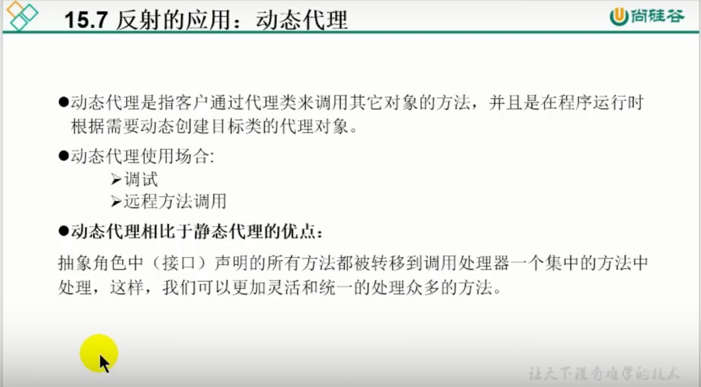

## 加载配置文件的方法

假设配置文件（.properties形式的文件）中的内容是：

> user=zhangsan
>
> password=123

**方法一**：使用类加载器加载配置文件

```java
//1.获取类加载器
ClassLoader cl = 类名.class.getClassLoader（）；
//或 ClassLoader cl=this.getClass().getClassLoader(); 

//2.使用类装载器读取配置文件
InputStream is= cl.getResourceAsStream("配置文件全名");
Properties prop = new Properties();
prop.load(is); 

//以下代码输出为 zhangsan 123
String user = prop.getProperty("user");
String password = prop.getProperty("password");
System.out.println(user+" "+password);
```

**方法二**：使用ServletContext加载文件

```java
//1.使用ServletContext加载配置文件
//加载位于WebRoot目录下的配置文件
InputStream in =this.getServletContext().getResourceAsStream("/配置文件名（.properties形式的文件）");
Properties prop = new Properties();
prop.load(in)

//以下代码输出为 zhangsan 123
String user = prop.getProperty("user");
String password = prop.getProperty("password");
System.out.println(user+" "+password);
```

**方法三：**通过数据流来读取

```java
//1.获取类加载器
ClassLoader cl = 类名.class.getClassLoader（）；
//或 ClassLoader cl=this.getClass().getClassLoader(); 

//2.使用类装载器读取配置文件
FileInputStream fis = new FileLoaderStream("配置文件全名")
Properties prop = new Properties();
prop.load(fis); 

//以下代码输出为 zhangsan 123
String user = prop.getProperty("user");
String password = prop.getProperty("password");
System.out.println(user+" "+password);
```

## 动态代理


