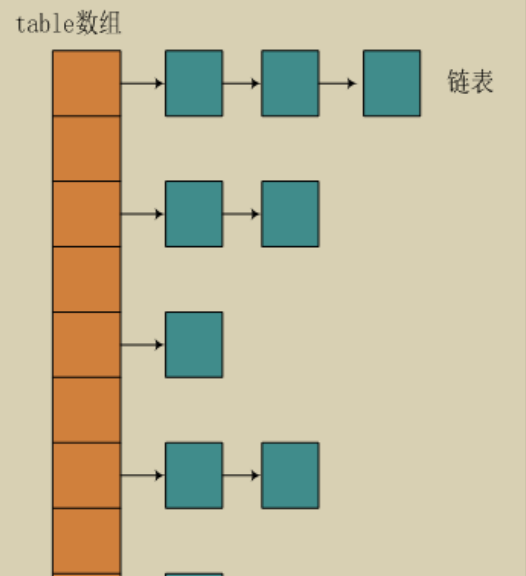
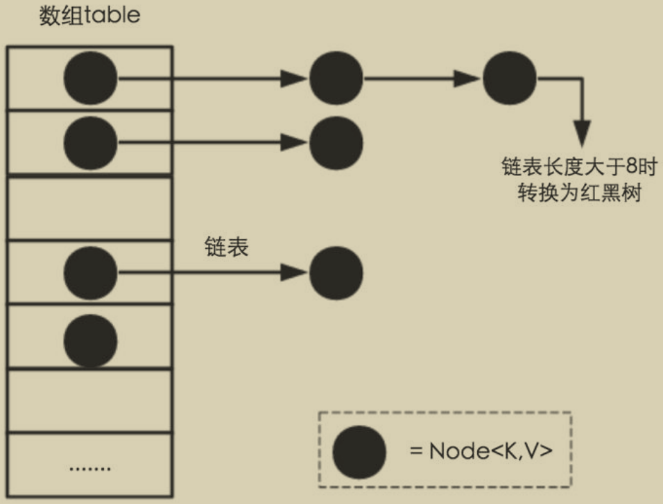
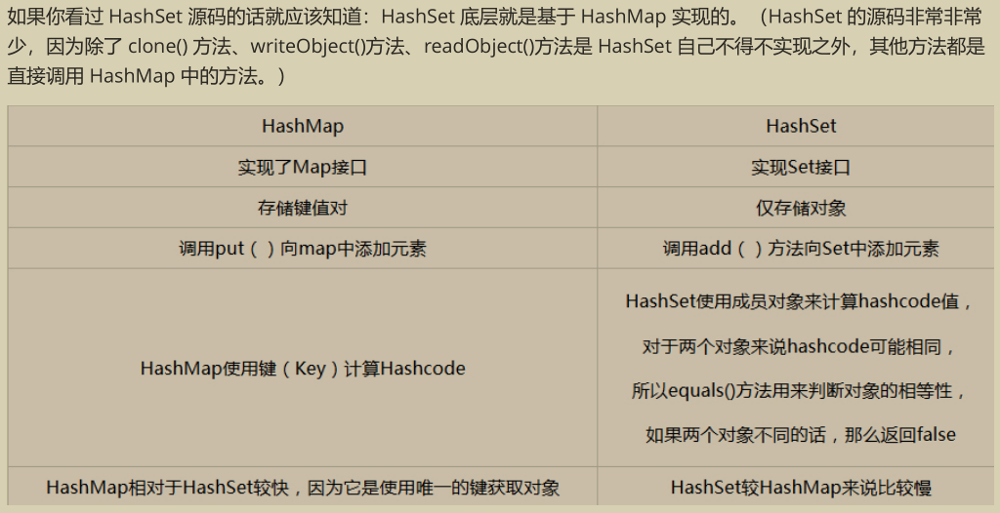
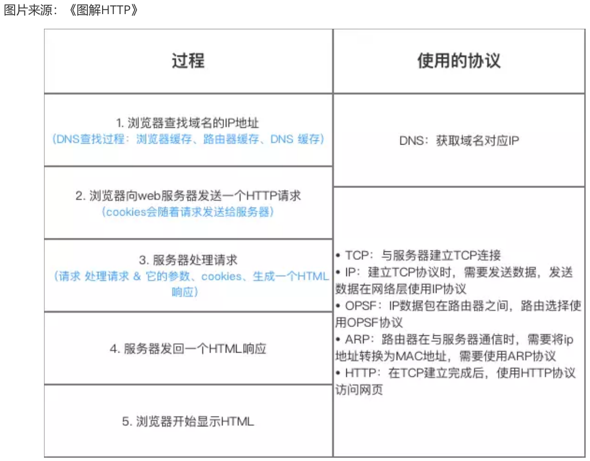
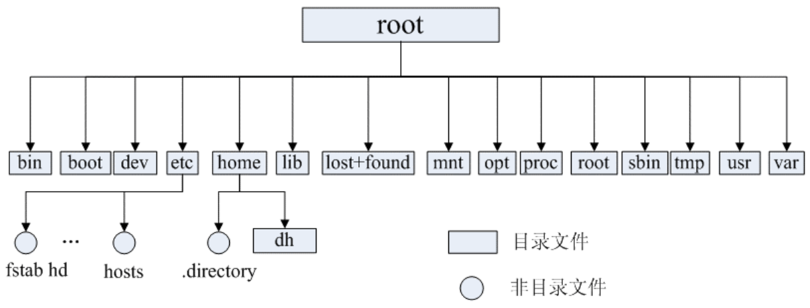

## Java

### Java基础知识

#### 访问权限（default、public、private、protected）

**default：“友好的”**
当前包内的其他所有类都能访问“友好的”成员，但对包外来说，这些成员是“私有的”，外界无法访问。

**public**
可以修饰类、成员变量、成员函数；任何皆可访问public成员

**private**
可以修饰成员变量、成员函数；只能在类内访问。

**protected：友好的一种**
protected的意思是“它本身是私有的，但可由从这个类继承的任何东西或者同一个包内的其他任何东西访问”。也就是说，Java 中的protected 会成为进入“友好”状态。


#### 重载和重写的区别

> 参考文章：[java 重载、重写、构造函数详解](https://www.cnblogs.com/0201zcr/p/4853283.html)

> 重载对应编译时，重写对应运行时。

**重载**：

- 方法名要一样，但是参数类型和个数不一样
- 无法以返回型别作为重载函数的区分标准，即返回值类型可以相同也可以不相同
- 被重载的方法可以改变访问修饰符
- 方法能够在一个类中或者在一个子类中被重载

**重写**： 

- 发生在父子类中，方法名、参数列表必须相同
- 返回类型必须与被重写方法的返回类型相同
- 访问修饰符范围大于等于父类（public>protected>default>private）
- 重写方法不能抛出新的异常或者比被重写方法声明的检查异常更广的检查异常。但是可以抛出更少，更有限或者不抛出异常
- 被final修饰的方法不能被复写
- 如果父类方法访问修饰符为 private 则子类就不能重写该方法。


#### String 和 StringBuffer、StringBuilder 的区别是什么？String 为什么是不可变的？

**可变性**
简单的来说：String 类中使用 final 关键字字符数组保存字符串， `private final char value[] `，所以 String
对象是不可变的。而StringBuilder 与 StringBuffer 都继承自 AbstractStringBuilder 类，在AbstractStringBuilder
中也是使用字符数组保存字符串 `char[]value` ，但是没有用 final 关键字修饰，所以这两种对象都是可变的。
StringBuilder 与 StringBuffer 的构造方法都是调用父类构造方法也就是 AbstractStringBuilder 实现的，大家可以自行查阅源码。

AbstractStringBuilder.java

```java
abstract class AbstractStringBuilder implements Appendable, CharSequence {
  char[] value;
  int count;
  AbstractStringBuilder() {
 }
  AbstractStringBuilder(int capacity) {
    value = new char[capacity];
 }
```


**线程安全性**
String 中的对象是不可变的，也就可以理解为常量，线程安全。AbstractStringBuilder 是 StringBuilder 与
StringBuffer 的公共父类，定义了一些字符串的基本操作，如 expandCapacity、append、insert、indexOf 等公共方法。StringBuffer 对方法加了同步锁或者对调用的方法加了同步锁，所以是线程安全的。StringBuilder 并没有对方法进行加同步锁，所以是非线程安全的。

**性能**

每次对 String 类型进行改变的时候，都会生成一个新的 String 对象，然后将指针指向新的 String 对象。
StringBuffer 每次都会对 StringBuffer 对象本身进行操作，而不是生成新的对象并改变对象引用。相同情况下使用StirngBuilder 相比使用 StringBuffer 仅能获得 10%~15% 左右的性能提升，但却要冒多线程不安全的风险。

**对于三者使用的总结：**

1. 操作少量的数据 = String
2. 单线程操作字符串缓冲区下操作大量数据 = StringBuilder
3. 多线程操作字符串缓冲区下操作大量数据 = StringBuffer


#### 自动装箱与拆箱

**装箱**：将基本类型用它们对应的引用类型包装起来；
**拆箱**：将包装类型转换为基本数据类型；


#### == 与 equals

**==** : 它的作用是判断两个对象的地址是不是相等。即，判断两个对象是不是同一个对象。(基本数据类型==比较的是值，引用数据类型==比较的是内存地址)

**equals()** : 它的作用也是判断两个对象是否相等。但它一般有两种使用情况：

- 情况1：类没有覆盖 equals() 方法。则通过 equals() 比较该类的两个对象时，等价于通过“==”比较这两个对象。
- 情况2：类覆盖了 equals() 方法。一般，我们都覆盖 equals() 方法来两个对象的内容相等；若它们的内容相
  等，则返回 true (即，认为这两个对象相等)。

**举个例子：**

```java
public class test1 {
  public static void main(String[] args) {
    String a = new String("ab"); // a 为一个引用
    String b = new String("ab"); // b为另一个引用,对象的内容一样
    String aa = "ab"; // 放在常量池中
    String bb = "ab"; // 从常量池中查找
    if (aa == bb) // true
      System.out.println("aa==bb");
    if (a == b) // false，非同一对象
      System.out.println("a==b");
    if (a.equals(b)) // true
      System.out.println("aEQb");
    if (42 == 42.0) { // true
      System.out.println("true");
   }
 }
}
```

**说明：**

- String 中的 equals 方法是被重写过的，因为 object 的 equals 方法是比较的对象的内存地址，而 String 的
  equals 方法比较的是对象的值。
- 当创建 String 类型的对象时，虚拟机会在常量池中查找有没有已经存在的值和要创建的值相同的对象，如果有就把它赋给当前引用。如果没有就在常量池中重新创建一个 String 对象。


#### equals方法与hashCode方法比较

 如果两个对象使用equals比较返回true,那么它们的hashCode值一定要相同，所以，重写了equals方法一般都要重写hashCode方法。


hashCode()相等的两个对象他们的equal()不一定相等，也就是hashCode()不是绝对可靠的。

因为重写的equal（）里一般比较的比较全面比较复杂，这样效率就比较低，而利用hashCode()进行对比，则只要生成一个hash值进行比较就可以了，效率很高，那么hashCode()既然效率这么高为什么还要equal()呢？因为hashCode()并不是完全可靠，有时候不同的对象他们生成的hashcode也会一样（生成hash值得公式可能存在的问题），所以hashCode()只能说是大部分时候可靠，并不是绝对可靠。

hashcode方法一般只有在集合中用到

> 将对象放入到集合中时，首先判断要放入对象的hashcode值与集合中的任意一个元素的hashcode值是否相等，如果不相等直接将该对象放入集合中。如果hashcode值相等，然后再通过equals方法判断要放入对象与集合中的任意一个对象是否相等，如果equals判断不相等，直接将该元素放入到集合中，否则不放入。


#### 关于 final 关键字的一些总结

final关键字主要用在三个地方：变量、方法、类。

1. 对于一个final变量，如果是基本数据类型的变量，则其数值一旦在初始化之后便不能更改；如果是引用类型的变量，则在对其初始化之后便不能再让其指向另一个对象。
2. 被final修饰的方法不能被复写。使用final方法的原因有两个。第一个原因是把方法锁定，以防任何继承类修改它的含义；第二个原因是效率。在早期的Java实现版本中，会将final方法转为内嵌调用。但是如果方法过于庞大，可能看不到内嵌调用带来的任何性能提升（现在的Java版本已经不需要使用final方法进行这些优化了）。类中所有的private方法都隐式地指定为final。
3. 当用final修饰一个类时，表明这个类不能被继承。final类中的所有成员方法都会被隐式地指定为final方法。

#### java中的异常

> 在 java 中，异常是扰乱程序正常流程的事件，它是在程序运行时抛出的对象。

**java异常类层次结构**


在 Java 中，所有的异常都有一个共同的祖先java.lang包中的 Throwable类。Throwable： 有两个重要的子类：
**Exception（异常）** 和 **Error（错误）** ，二者都是 Java 异常处理的重要子类，各自都包含大量子类。


**异常分类**

主要有两种类型的异常：**受查和非受查异常**，`Error`被视为非受查异常。Sun公司认为有三种异常类型：

> - 受查异常（Checked Exception）
> - 非受查异常（UnChecked Exception）
> - 错误（Error）

**1）受查异常**

除了`RuntimeException`和`Error`外，继承自`Throwable`类的类称为受查异常，例如：IOException、SQLException 等。**受查异常在编译时进行检查。**

常见的有以下几个方面：

- 试图在文件尾部后面读取数据
- 试图打开一个不存在的文件
- 试图根据给定的字符串查找Class对象，而这个字符串表示的类并不存在

**2）非受查异常**

继承自`RuntimeException`类的异常被称为非受查异常，例如：ArithmeticException、 NullPointerException、 ArrayIndexOutOfBoundsException 等。**非受查异常不会在编译时检查，而是在运行时进行检查**。

常见的有以下几个方面：

- 错误的类型转换
- 数组访问越界
- 访问null指针

“如果出现了`RuntimeException`异常，那么一定是你自身的问题”，是一条相当有道理的规则。

**3）错误（Error）**

错误是一种无法恢复的异常类型，通常是在java运行时系统的内部错误和资源耗尽错误。大多数错误与代码编写者执行的操作无关，而表示代码运行时 JVM（Java 虚拟机）出现的问题。应用程序不应该抛出这种类型的对象。如果出现了这样的内部错误，除了通告给用户，并尽力的使得程序安全的终止之外，再也无能为力了。这种情况很少出现。

**异常处理总结**

- try 块：用于捕获异常。其后可接零个或多个catch块，如果没有catch块，则必须跟一个finally块。
- catch 块：用于处理try捕获到的异常。
- finally 块：无论是否捕获或处理异常，finally块里的语句都会被执行。当在try块或catch块中遇到return语句
  时，finally语句块将在方法返回之前被执行。


**在以下4种特殊情况下，finally块不会被执行：**

1. 在finally语句块中发生了异常。
2. 在前面的代码中用了System.exit()退出程序。
3. 程序所在的线程死亡。
4. 关闭CPU。


#### 接口和抽象类的区别是什么

1）抽象类可以提供成员方法的实现细节，而接口中只能存在public abstract 方法；

2）抽象类中的成员变量可以是各种类型的，而接口中的成员变量只能是public static final类型的；

3）接口中不能含有静态代码块以及静态方法，而抽象类可以有静态代码块和静态方法；

4）一个类只能继承一个抽象类，而一个类却可以实现多个接口。


#### 既然有了字节流,为什么还要有字符流?

问题本质想问：**不管是文件读写还是网络发送接收，信息的最小存储单元都是字节，那为什么 I/O 流操作要分为字节流操作和字符流操作呢？**

回答：字符流是由 Java 虚拟机将字节转换得到的，问题就出在这个过程还算是非常耗时，并且，如果我们不知道编码类型就很容易出现乱码问题。所以， I/O 流就干脆提供了一个直接操作字符的接口，方便我们平时对字符进行流操作。如果音频文件、图片等媒体文件用字节流比较好，如果涉及到字符的话使用字符流比较好。


### java集合框架

#### Arraylist 与 LinkedList 异同

1. **是否保证线程安全**： ArrayList 和 LinkedList 都是不同步的，也就是不保证线程安全；

2. **底层数据结构**： Arraylist 底层使用的是Object数组；LinkedList 底层使用的是双向链表数据结构；
3. **插入和删除是否受元素位置的影响**： ① ArrayList 采用数组存储，所以插入和删除元素的时间复杂度受元素
   位置的影响。 比如：执行 add(E e) 方法的时候， ArrayList 会默认在将指定的元素追加到此列表的末尾，这种情况时间复杂度就是O(1)。但是如果要在指定位置 i 插入和删除元素的话（ add(int index, E element) ）时
   间复杂度就为 O(n-i)。因为在进行上述操作的时候集合中第 i 和第 i 个元素之后的(n-i)个元素都要执行向后位/向前移一位的操作。 ② LinkedList 采用链表存储，所以插入，删除元素时间复杂度不受元素位置的影响，都是近似 O（1）而数组为近似 O（n）。
4. **是否支持快速随机访问**： LinkedList 不支持高效的随机元素访问，而 ArrayList 支持。快速随机访问就是通
    过元素的序号快速获取元素对象(对应于 get(int index) 方法)。
5. **内存空间占用**： ArrayList的空 间浪费主要体现在在list列表的结尾会预留一定的容量空间，而LinkedList的空
    间花费则体现在它的每一个元素都需要消耗比ArrayList更多的空间（因为要存放直接后继和直接前驱以及数
    据）。

#### HashMap的底层实现

**JDK1.8之前**
JDK1.8 之前 HashMap 底层是 **数组和链表** 结合在一起使用也就是 **链表散列**。HashMap 通过 key 的 hashCode 经过扰动函数处理过后得到 hash 值，然后通过 (n - 1) & hash 判断当前元素存放的位置（这里的 n 指的是数组的
长度），如果当前位置存在元素的话，就判断该元素与要存入的元素的 hash 值以及 key 是否相同，如果相同的
话，直接覆盖，不相同就通过拉链法解决冲突。

所谓扰动函数指的就是 HashMap 的 hash 方法。使用 hash 方法也就是扰动函数是为了防止一些实现比较差的
hashCode() 方法 换句话说使用扰动函数之后可以减少碰撞。

JDK 1.8 HashMap 的 hash 方法源码:

JDK 1.8 的 hash方法 相比于 JDK 1.7 hash 方法更加简化，但是原理不变。

```JAVA
static final int hash(Object key) {
    int h;
    // key.hashCode()：返回散列值也就是hashcode
    // ^ ：按位异或
    // >>>:无符号右移，忽略符号位，空位都以0补齐
    return (key == null) ? 0 : (h = key.hashCode()) ^ (h >>> 16);
 }
```

对比一下 JDK1.7的 HashMap 的 hash 方法源码.

```JAVA
static int hash(int h) {
  // This function ensures that hashCodes that differ only by
  // constant multiples at each bit position have a bounded
  // number of collisions (approximately 8 at default load factor).
  h ^= (h >>> 20) ^ (h >>> 12);
  return h ^ (h >>> 7) ^ (h >>> 4);
}
```

相比于 JDK1.8 的 hash 方法 ，JDK 1.7 的 hash 方法的性能会稍差一点点，因为毕竟扰动了 4 次。

所谓 “**拉链法**” 就是：将链表和数组相结合。也就是说创建一个链表数组，数组中每一格就是一个链表。若遇到哈希冲突，则将冲突的值加到链表中即可。



**JDK1.8之后**
相比于之前的版本， JDK1.8之后在解决哈希冲突时有了较大的变化，当链表长度大于阈值（默认为8）时，将链表转化为红黑树，以减少搜索时间。



> TreeMap、TreeSet以及JDK1.8之后的HashMap底层都用到了红黑树。红黑树就是为了解决二叉查找树的缺
> 陷，因为二叉查找树在某些情况下会退化成一个线性结构。

#### HashMap 的长度为什么是2的幂次方

为了能让 HashMap 存取高效，尽量较少碰撞，也就是要尽量把数据分配均匀。我们上面也讲到了过了，Hash 值的范围值-2147483648到2147483647，前后加起来大概40亿的映射空间，只要哈希函数映射得比较均匀松散，一般应用是很难出现碰撞的。但问题是一个40亿长度的数组，内存是放不下的。所以这个散列值是不能直接拿来用的。用之前还要先做对数组的长度取模运算，得到的余数才能用来要存放的位置也就是对应的数组下标。这个数组下标的计算方法是“ (n - 1) & hash ”。（n代表数组长度）。这也就解释了 HashMap 的长度为什么是2的幂次方。

**这个算法应该如何设计呢？**
我们首先可能会想到采用%取余的操作来实现。但是，重点来了：“取余(%)操作中如果除数是2的幂次则等价于与其除数减一的与(&)操作（也就是说 hash%length==hash&(length-1)的前提是 length 是2的 n 次方；）。” 并且 采用二进制位操作 &，相对于%能够提高运算效率，这就解释了 HashMap 的长度为什么是2的幂次方。

#### HashSet 和 HashMap 区别



#### 集合框架底层数据结构总结

**Collection**

- List
  - Arraylist： **Object数组**
  - Vector： **Object数组**
  - LinkedList：**双向链表**（JDK1.6之前为循环链表，JDK1.7取消了循环链表）

- Set
  - HashSet（无序，唯一）: 基于 HashMap 实现的，**底层采用 HashMap** 来保存元素
  - LinkedHashSet： LinkedHashSet 继承与 HashSet，并且其内部是通过 LinkedHashMap 来实现的。有点类似于我们之前说的LinkedHashMap 其内部是基于 Hashmap 实现一样，不过还是有一点点区别的。
  - TreeSet（有序，唯一）： **红黑树**(自平衡的排序二叉树。)

**Map**

- HashMap： JDK1.8之前HashMap由**数组+链表**组成的，数组是HashMap的主体，链表则是主要为了解决哈希冲突而存在的（“拉链法”解决冲突）.JDK1.8以后在解决哈希冲突时有了较大的变化，当链表长度大于阈值（默认为8）时，将**链表转化为红黑树**，以减少搜索时间
- LinkedHashMap: LinkedHashMap 继承自 HashMap，所以它的底层仍然是基于拉链式散列结构即由数组和链表或红黑树组成。另外，LinkedHashMap 在上面结构的基础上，增加了一条双向链表，使得上面的结构可以保持键值对的插入顺序。同时通过对链表进行相应的操作，实现了访问顺序相关逻辑。
- HashTable: **数组+链表**组成的，数组是 HashMap 的主体，链表则是主要为了解决哈希冲突而存在的
- TreeMap: **红黑树**（自平衡的排序二叉树）


### Java多线程

#### 简述线程、程序、进程的基本概念。以及他们之间关系是什么?

**线程**与进程相似，但线程是一个比进程更小的执行单位。一个进程在其执行的过程中可以产生多个线程。与进程不同的是同类的多个线程共享同一块内存空间和一组系统资源，所以系统在产生一个线程，或是在各个线程之间作切换工作时，负担要比进程小得多，也正因为如此，线程也被称为轻量级进程。

**程序**是含有指令和数据的文件，被存储在磁盘或其他的数据存储设备中，也就是说程序是静态的代码。

**进程**是程序的一次执行过程，是系统运行程序的基本单位，因此进程是动态的。系统运行一个程序即是一个进程从创建，运行到消亡的过程。简单来说，一个进程就是一个执行中的程序，它在计算机中一个指令接着一个指令地执行着，同时，每个进程还占有某些系统资源如CPU时间，内存空间，文件，输入输出设备的使用权等等。换句话说，当程序在执行时，将会被操作系统载入内存中。 线程是进程划分成的更小的运行单位。线程和进程最大的不同在于基本上各进程是独立的，而各线程则不一定，因为同一进程中的线程极有可能会相互影响。从另一角度来说，进程属于操作系统的范畴，主要是同一段时间内，可以同时执行一个以上的程序，而线程则是在同一程序内几乎同时执行一个以上的程序段。

#### Java虚拟机


#### 设计模式

设计模式比较常见的就是让你手写一个单例模式（注意单例模式的几种不同的实现方法）或者让你说一下某个常见的设计模式在你的项目中是如何使用的，另外面试官还有可能问你抽象工厂和工厂方法模式的区别、工厂模式的思想这样的问题。

建议把**代理模式、观察者模式、（抽象）工厂模式**好好看一下，这三个设计模式也很重要。


## 计算机网络

### TCP和UDP的区别

UDP首部开销小，只有8个字节，所以UDP用户数据报最小长度为8字节；  而TCP首部至少20个字节（固定字节20+可变字段）

TCP是面向连接的，UDP是无连接的；

TCP是可靠的，UDP是不可靠的；

TCP只支持点对点通信；UDP支持一对一、一对多、多对一、多对多的通信模式；

TCP是面向字节流的；UDP是面向报文的；

TCP有拥塞控制机制；UDP没有拥塞控制，适合媒体通信

### TCP对应的协议和UDP对应的协议

**TCP对应的协议：**

（1）**FTP**：定义了文件传输协议，使用21端口。常说某某计算机开了FTP服务便是启动了文件传输服务。下载文件，上传主页，都要用到FTP服务。

（2）**Telnet**：它是一种用于远程登陆的端口，用户可以以自己的身份远程连接到计算机上，通过这种端口可以提供一种基于DOS模式下的通信服务。如以前的BBS是-纯字符界面的，支持BBS的服务器将23端口打开，对外提供服务。

（3） **SMTP**：定义了简单邮件传送协议，现在很多邮件服务器都用的是这个协议，用于发送邮件。如常见的免费邮件服务中用的就是这个邮件服务端口，所以在电子邮件设置-中常看到有这么SMTP端口设置这个栏，服务器开放的是25号端口。

（4） **POP3**：它是和SMTP对应，POP3用于接收邮件。通常情况下，POP3协议所用的是110端口。也是说，只要你有相应的使用POP3协议的程序（例如Fo-xmail或Outlook），就可以不以Web方式登陆进邮箱界面，直接用邮件程序就可以收到邮件（如是163邮箱就没有必要先进入网易网站，再进入自己的邮-箱来收信）。

（5）**HTTP协议**：是从Web服务器传输超文本到本地浏览器的传送协议。

**UDP对应的协议：**

（1） **DNS**：用于域名解析服务，将域名地址转换为IP地址。DNS用的是53号端口。

（2） **SNMP**：简单网络管理协议，使用161号端口，是用来管理网络设备的。由于网络设备很多，无连接的服务就体现出其优势。

（3） **TFTP**(Trival File Transfer Protocal)，简单文件传输协议，该协议在熟知端口69上使用UDP服务。

### 在浏览器中输入url地址 ->> 显示主页的过程




总体来说分为以下几个过程:
1. DNS解析
2. TCP连接
3. 发送HTTP请求
4. 服务器处理请求并返回HTTP报文
5. 浏览器解析渲染页面
6. 连接结束

具体可以参考下面这篇文章：

[https://segmentfault.com/a/1190000006879700](https://segmentfault.com/a/1190000006879700)


### 三次握手和四次挥手

 

### 为什么TCP是三次握手和四次挥手？

[tcp建立连接为什么需要三次握手](<https://www.jianshu.com/p/e7f45779008a>)

 

## Linux

### Linux文件系统和目录结构

#### 文件系统简介

在Linux操作系统中，所有被操作系统管理的资源，例如网络接口卡、磁盘驱动器、打印机、输入输出设备、普通文件或是目录都被看作是一个文件。

也就是说在LINUX系统中有一个重要的概念：一切都是文件。其实这是UNIX哲学的一个体现，而Linux是重写UNIX而来，所以这个概念也就传承了下来。在UNIX系统中，把一切资源都看作是文件，包括硬件设备。UNIX系统把每个硬件都看成是一个文件，通常称为设备文件，这样用户就可以用读写文件的方式实现对硬件的访问。


#### 目录结构及简介



**常见目录说明：**
/bin： 存放二进制可执行文件(ls,cat,mkdir等)，常用命令一般都在这里；
/etc： 存放系统管理和配置文件；
/home： 存放所有用户文件的根目录，是用户主目录的基点，比如用户user的主目录就是/home/user，可以
用~user表示；
/usr ： 用于存放系统应用程序；
/opt： 额外安装的可选应用程序包所放置的位置。一般情况下，我们可以把tomcat等都安装到这里；
/proc： 虚拟文件系统目录，是系统内存的映射。可直接访问这个目录来获取系统信息；
/root： 超级用户（系统管理员）的主目录（特权阶级^o^）；
/sbin: 存放二进制可执行文件，只有root才能访问。这里存放的是系统管理员使用的系统级别的管理命令和程
序。如ifconfig等；
/dev： 用于存放设备文件；
/mnt： 系统管理员安装临时文件系统的安装点，系统提供这个目录是让用户临时挂载其他的文件系统；
/boot： 存放用于系统引导时使用的各种文件；
/lib ： 存放着和系统运行相关的库文件 ；
/tmp： 用于存放各种临时文件，是公用的临时文件存储点；
/var： 用于存放运行时需要改变数据的文件，也是某些大文件的溢出区，比方说各种服务的日志文件（系统启
动日志等。）等；
/lost+found： 这个目录平时是空的，系统非正常关机而留下“无家可归”的文件（windows下叫什么.chk）就在
这里