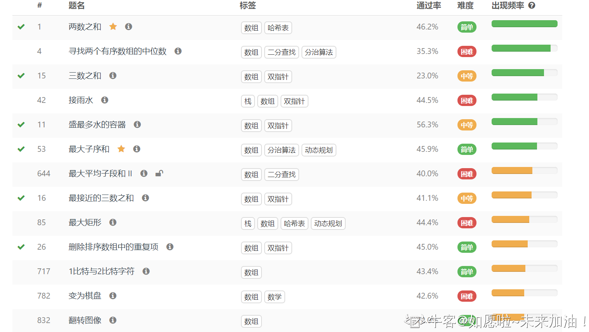
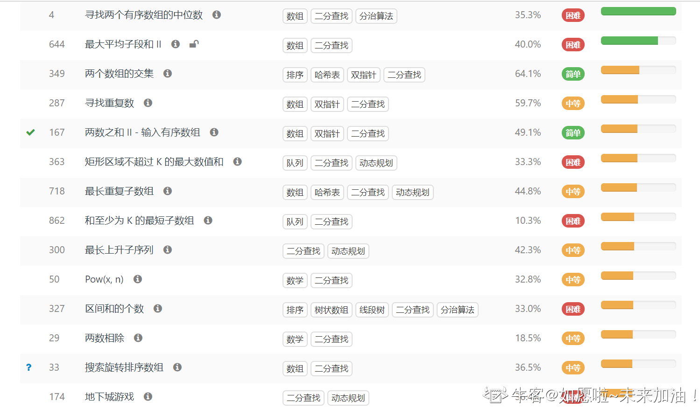
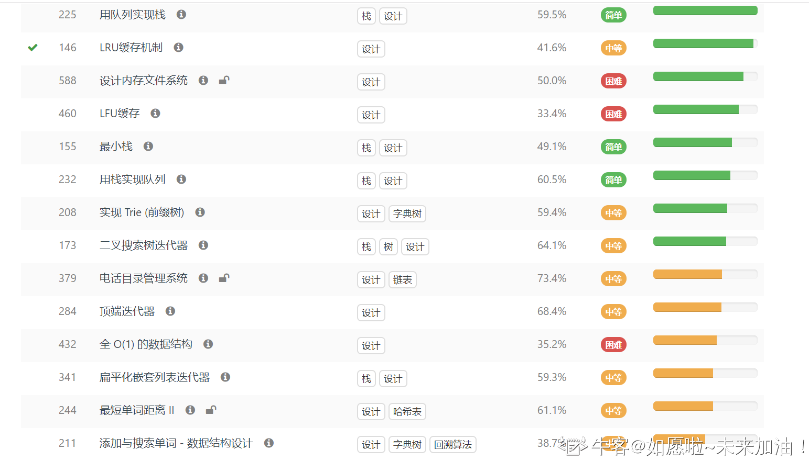
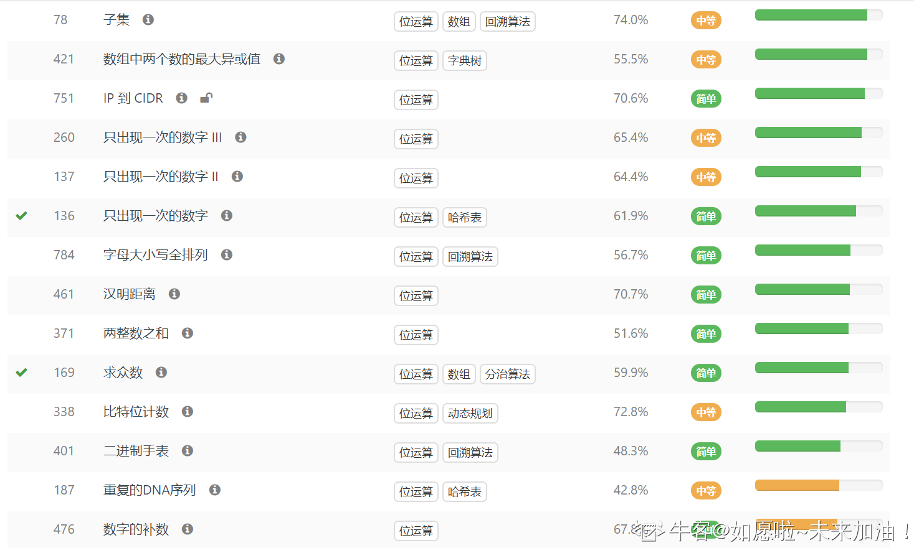

### 

五毒神掌 by 覃超


### 动态规划

#### 070 爬楼梯(类同斐波那契)

##### 解法一：递归法

> 缺点：涉及多次重复计算，时间复杂度高，易超时

```JAVA
class Solution {
    public int climbStairs(int n) {
        if(n < 1) return 0;
        if(n == 1) return 1;
        if(n == 2) return 2;

        return climbStairs(n - 1) + climbStairs(n - 2);

    }
}
```

##### 解法二：通过记忆计算过的结果，优化递归法

```java
class Solution {
    Map<Integer, Integer> dp = new HashMap<>();
    public int climbStairs(int n) {
        if(n < 1) return 0;
        if(n == 1) return 1;
        if(n == 2) return 2;

        if(dp.containsKey(n)){
            return dp.get(n);
        }

        int steps = climbStairs(n - 1) + climbStairs(n - 2);
        //存储计算过的结果
        dp.put(n, steps);
        return steps;
    }
}
```

##### 解法三：动态规划法 √

```java
class Solution {
    public int climbStairs(int n) {
        if(n <= 0) return 0;
        if(n == 1) return 1;
        if(n == 2) return 2;

        int oneStepBefore = 2;
        int twoStepBefore = 1;
        int allWays = 0;

        for(int i = 2; i < n; i++){
            allWays = oneStepBefore + twoStepBefore;
            twoStepBefore = oneStepBefore;
            oneStepBefore = allWays;
        }

        return allWays;

    }
}
```

#### 005 最长回文子串

```java
class Solution {
    public String longestPalindrome(String s) {
        int len = s.length();
        //特殊
        if(len < 2) return s;

        int maxLen = 1;
        int begin = 0;
        //dp[i][j]表示s[i][j]是否是回文串
        boolean[][] dp = new boolean[len][len];
        char[] c = s.toCharArray();

        for(int j = 1; j < len; j++){
            for(int i = 0; i < j; i++){
                if(c[i] != c[j]){
                    dp[i][j] = false;
                }else{
                    if(j - i < 3){
                        dp[i][j] = true;
                    }else{
                        dp[i][j] = dp[i + 1][j -1];
                    }
                }

                if(dp[i][j] && j -i + 1 > maxLen){
                    maxLen = j - i + 1;
                    begin = i;
                }

            }
        }

        return s.substring(begin, begin + maxLen);

    }
}
```

**复杂度分析：**

时间复杂度：O(N2)。

空间复杂度：O(N2)。


### 滑动窗口(Sliding Window)


### 树

### 深度优先遍历

### 回溯算法

#### 46 全排列（一）

```java
class Solution {
    //深度优先遍历dfs,回溯法
    public List<List<Integer>> permute(int[] nums) {
        int len = nums.length;
        //保存最后结果
        List<List<Integer>> res = new ArrayList<>();
        
        if(len == 0){
            return res;
        }

        //记录某数是否已添加进pathpath，初始值为false
        boolean[] used = new boolean[len];    
        //保存每一次遍历的结果
        LinkedList<Integer> path = new LinkedList<>();
       
        dfs(nums, 0, used, path, res);

        return res;
    }

    private void dfs(int[] nums, int depth, boolean[] used, LinkedList<Integer> path, List<List<Integer>> res){
        if(depth == nums.length){
            res.add(new ArrayList<>(path));
            return;
        }

        for(int i=0; i < nums.length; i++){
            if(!used[i]){
                path.addLast(nums[i]);
                used[i] = true;

                dfs(nums, depth + 1, used, path, res);

                used[i] = false;
                path.removeLast();
            }
        }

    }
}
```


#### 47 全排列（二）

```java
class Solution {
    //深度优先遍历dfs
    public List<List<Integer>> permuteUnique(int[] nums) {
        int len = nums.length;
        //保存最后结果
        List<List<Integer>> res = new ArrayList<>();
        
        if (len == 0) {
            return res;
        }

        // 排序（升序或者降序都可以），排序是剪枝的前提
        Arrays.sort(nums);

        //记录某数是否已添加进pathpath
        boolean[] used = new boolean[len];    
        //保存每一次遍历的结果
        LinkedList<Integer> path = new LinkedList<>();
       
        dfs(nums, 0, used, path, res);

        return res;
    }

    private void dfs(int[] nums, int depth, boolean[] used, LinkedList<Integer> path, List<List<Integer>> res){
        if(depth == nums.length){
            res.add(new ArrayList<>(path));
            return;
        }

        for(int i=0; i < nums.length; i++){
            if(used[i]){
                continue;
            }

            //剪枝
            if(i > 0 && nums[i] == nums[i-1] && !used[i-1]){
                continue;
            }

            path.addLast(nums[i]);
            used[i] = true;

            dfs(nums, depth + 1, used, path, res);

            used[i] = false;
            path.removeLast();
        }

    }
}

```

#### J38 字符串的排列（与leetcode46、47类似）

```java
class Solution {
    public String[] permutation(String s) {
        char[] c = s.toCharArray();
        int len = c.length;
        List<String> res = new ArrayList<>();
        if(len == 0){
            return new String[0];
        }

        // 排序（升序或者降序都可以），排序是剪枝的前提
        Arrays.sort(c);

        boolean[] used = new boolean[len];
        StringBuilder path = new StringBuilder();

        dfs(c, used, path, res);

        String[] str = new String[res.size()];

        // 使用该语句效果等同，时间效率会更高：
        // return res.toArray(new String[res.size()]);
        for(int i = 0; i < res.size(); i++){
            str[i] = res.get(i);
        }
        return str;
    }

    private void dfs(char[] c, boolean[] used, StringBuilder path, List<String> res){
        if(path.length() == c.length){
            res.add(new String(path));
            return;
        }

        for(int i = 0; i < c.length; i++){
            if(used[i]){
                continue;
            }

            // 剪枝条件：i > 0 是为了保证 nums[i - 1] 有意义
            // 写 !used[i - 1] 是因为 nums[i - 1] 在深度优先遍历的过程中刚刚被撤销选择
            if(i > 0 && c[i] == c[i-1] && !used[i-1]){
                continue;
            }

            path.append(c[i]);
            used[i] = true;
            dfs(c, used, path, res);
            // 回溯部分的代码，和 dfs 之前的代码是对称的
            used[i] = false;
            path.deleteCharAt(path.length() - 1);

        }
        
    }
}
```


#### 

### Hot 100

#### 001 两数之和（哈希表）

##### 解法一：暴力法

```java
class Solution {
    public int[] twoSum(int[] nums, int target) {
        int[] result = {};
        label:
        for(int i = 0; i < nums.length; i++){
            for(int j = i + 1; j < nums.length; j++){
                if(nums[i] + nums[j] == target){
                    result = new int[]{i,j};
                    break label;
                }
            }
        }

        //throw new IllegalArgumentException("No two sum solution");

        return result;
    }
}
```

**复杂度分析：**

时间复杂度：O(n2)

空间复杂度：O(1)


##### 解法二：哈希表 √

```java
class Solution {
    public int[] twoSum(int[] nums, int target) {
        Map<Integer, Integer> map = new HashMap<>();
        for (int i = 0; i < nums.length; i++) {
            int complement = target - nums[i];
            if (map.containsKey(complement)) {
                return new int[] { map.get(complement), i };
            }
            map.put(nums[i], i);
        }
        return null;
        //throw new IllegalArgumentException("No two sum solution");
    }
}
```

**复杂度分析：**

时间复杂度：O(n)

空间复杂度：O(n)


#### 002 两数相加（链表&数学）

```java
/**
 * Definition for singly-linked list.
 * public class ListNode {
 *     int val;
 *     ListNode next;
 *     ListNode(int x) { val = x; }
 * }
 */
class Solution {
    public static ListNode addTwoNumbers(ListNode l1, ListNode l2){
        ListNode preHead = new ListNode(0);
        ListNode preHead1 = preHead;
        
        int carry = 0;
        while(l1 != null | l2 != null){
            int x = (l1 != null)? l1.val : 0;
            int y = (l2 != null)? l2.val : 0;
            int sum = (x + y + carry);
            carry = sum / 10;
            preHead1.next = new ListNode(sum%10);

            if(l1 != null) l1 = l1.next;
            if(l2 != null) l2 = l2.next;

            preHead1 = preHead1.next;
        }
        
        if(carry > 0){
            preHead1.next = new ListNode(carry);
        }

        return preHead.next;
         
    }
}
```

**复杂度分析：**

时间复杂度：O(max⁡(m,n))

空间复杂度：O(max⁡(m,n))


#### 003 无重复字符的最长子串（双指针&滑动窗口）

##### 方法一：HashSet √

```java
class Solution {
    //滑动窗口，left窗口每次移动一格
    public int lengthOfLongestSubstring(String s) {
        //字符的泛型用Character
        Set<Character> set = new HashSet<Character>();
        int n = s.length();
        int maxLength = 0, right = 0;

        for(int left = 0; left < n; left++){

            while(right < n && !set.contains(s.charAt(right))){
                set.add(s.charAt(right));
                right++;
            }

            set.remove(s.charAt(left));


            maxLength = Math.max(right - left, maxLength);
        } 

        return maxLength;

    }
}
```

**复杂度分析：**

时间复杂度：O(N)，其中 N 是字符串的长度。左指针和右指针分别会遍历整个字符串一次。

空间复杂度：O(∣Σ∣)，其中 Σ 表示字符集（即字符串中可以出现的字符），∣Σ∣ 表示字符集的大小。在本题中没有明确说明字符集，因此可以默认为所有 ASCII 码在 [0,128)内的字符，即 ∣Σ∣=128。我们需要用到哈希集合来存储出现过的字符，而字符最多有 ∣Σ∣ 个，因此空间复杂度为 O(∣Σ∣)。

##### 方法二：HashMap

```java
class Solution {
    //滑动窗口，left窗口每次移动到重复字符的下一个位置
    public int lengthOfLongestSubstring(String s) {
        if (s.length()==0) return 0;
        Map<Character, Integer> map = new HashMap<Character, Integer>();
        int maxLength = 0;
        int left = 0;
        for(int right = 0; right < s.length(); right ++){
            char char1 = s.charAt(right)
            if(map.containsKey(char1)){
                left = Math.max(left,map.get(char1) + 1);
            }
            map.put(char1,right);
            maxLength = Math.max(maxLength,right-left+1);
        }
        return maxLength;
        
    }
}

```


#### 004 寻找两个正序数组的中位数（分治算法）

```java
class Solution {
    //思路：找出两个数组中的第k小个数，此处k=(nums1.length+nums2.length)/2
    public double findMedianSortedArrays(int[] nums1, int[] nums2) {
        int len1 = nums1.length;
        int len2 = nums2.length;
        int k = (len1 + len2)/2;
        //判断两个数组总长度奇偶性
        boolean isOdd = ((len1 + len2) & 1) == 0? false : true;
        //int isOdd = (len1 + len2) % 2;
        //用&判断奇偶比用%效率高

        if(isOdd){
            return getKth(nums1, 0, len1-1, nums2, 0, len2-1, k+1);
        }else{
            return (getKth(nums1, 0, len1-1, nums2, 0, len2-1, k) + getKth(nums1, 0, len1-1, nums2, 0, len2-1, k+1))*0.5;
        }
    }

    public int getKth(int[] nums1, int start1, int end1, int[] nums2, int start2, int end2, int k){
        int len1 = end1 - start1 + 1;
        int len2 = end2 - start2 + 1;
        //递归出口
        if(len1 == 0) return nums2[start2+k-1];
        if(len2 == 0) return nums1[start1+k-1];
        if(k==1){return Math.min(nums1[start1],nums2[start2]);} 

        //处理len比k/2小的情况
        int i = start1 + Math.min(len1, k/2) -1;
        int j = start2 + Math.min(len2, k/2) -1;

        if(nums1[i] < nums2[j]){
            return getKth(nums1, i+1, end1, nums2, start2, end2, k-(i-start1+1));
        }else{
            return getKth(nums1, start1, end1, nums2, j+1, end2, k-(j-start2+1));
        }
        
    }

}  

```

**复杂度分析：**

时间复杂度：每进行一次循环，我们就减少 k/2 个元素，所以时间复杂度是 O(log(k)，而 k=(m+n)/2，所以最终的复杂也就是 **O(log(m+n）**。

空间复杂度：虽然我们用到了递归，但是可以看到这个递归**属于尾递归，所以编译器不需要不停地堆栈**，所以空间复杂度为 **O(1)**。


#### 169 多数元素

```java
class Solution {
    public int majorityElement(int[] nums){
        Map<Integer, Integer> countNums = new HashMap<Integer, Integer>();
        for(int num : nums){
            if(!countNums.containsKey(num)){
                countNums.put(num, 1);
            }else{
                countNums.put(num, countNums.get(num) + 1);
            }
        }

        //比较之后需要获取整个entry，因为不能从值推出键。
        Map.Entry<Integer, Integer> majorityEntry = null;

        for(Map.Entry<Integer, Integer> entry : countNums.entrySet()){
            if(majorityEntry == null || entry.getValue() > majorityEntry.getValue()){
                majorityEntry = entry;
            }
        }

        return majorityEntry.getKey();
    }
}
```

**复杂度分析：**

时间复杂度：O(n)，其中 n 是数组 nums 的长度。我们遍历数组 nums 一次，**对于 nums 中的每一个元素，将其插入哈希表都只需要常数时间。**如果在遍历时没有维护最大值，在遍历结束后还需要对哈希表进行遍历，因为哈希表中占用的空间为 O(n)，那么遍历的时间不会超过 O(n)。因此总时间复杂度为 O(n)。

空间复杂度：O(n)


#### 206 反转链表

##### 方法一：双指针迭代 √

```java
class Solution {
	public ListNode reverseList(ListNode head) {
		//申请节点，pre，pre指向null
		ListNode pre = null;
		ListNode tmp = null;
		while(head!=null) {
			//记录当前节点的下一个节点
			tmp = head.next;
			//然后将当前节点指向pre
			head.next = pre;
			//pre和cur节点都前进一位
			pre = head;
			head = tmp;
		}
		return pre;
	}
}
```

**复杂度分析：**

时间复杂度：O(n)

空间复杂度：O(1)

**PS:以上解法可以改造为以下递归形式，但内存消耗会增大**

```JAVA
class Solution {
    ListNode pre = null, tmp = null;
    public ListNode reverseList(ListNode head) {
        if (head == null)
            return pre;
        tmp = head.next;
        head.next = pre;
        pre = head;
        head = tmp;
        return reverseList(head);
    }
}
```


##### 方法二：递归解法

```java
class Solution {
	public ListNode reverseList(ListNode head) {
		//递归终止条件是当前为空，或者下一个节点为空
		if(head==null || head.next==null) {
			return head;
		}
		//这里的cur就是最后一个节点
		ListNode cur = reverseList(head.next);
		//这里请配合动画演示理解
		//如果链表是 1->2->3->4->5，那么此时的cur就是5
		//而head是4，head的下一个是5，下下一个是空
		//所以head.next.next 就是5->4
		head.next.next = head;
		//防止链表循环，需要将head.next设置为空
		head.next = null;
		//每层递归函数都返回cur，也就是最后一个节点
		return cur;
	}
}
```


### 剑指offer

#### 03 数组中重复的数字(数组&哈希表)

##### 解法一：原地置换 √

```java
class Solution {
    public int findRepeatNumber(int[] nums) {
        int temp;
        for(int i=0;i<nums.length;i++){
            while (nums[i]!=i){
                if(nums[i]==nums[nums[i]]){
                    return nums[i];
                }
                temp=nums[i];
                nums[i]=nums[temp];
                nums[temp]=temp;
            }
        }
        return -1;
    }
}

```

##### 解法二：哈希表（set）

```java
class Solution {
    public int findRepeatNumber(int[] nums) {
        Set<Integer> dic = new HashSet<>();
        for(int num : nums) {
            if(dic.contains(num)) return num;
            dic.add(num);
        }
        return -1;
    }
}

```


#### **24 反转链表**（同leetcode206）


## 各题型频率


### 数组




### 链表


### 二叉树


### 哈希表


### 堆


### 二分查找




### 字符串


### 回溯算法


### 动态规划


### 贪心算法


### 数学


### 设计




### 位运算




### 广度优先搜索


### 深度优先搜索

